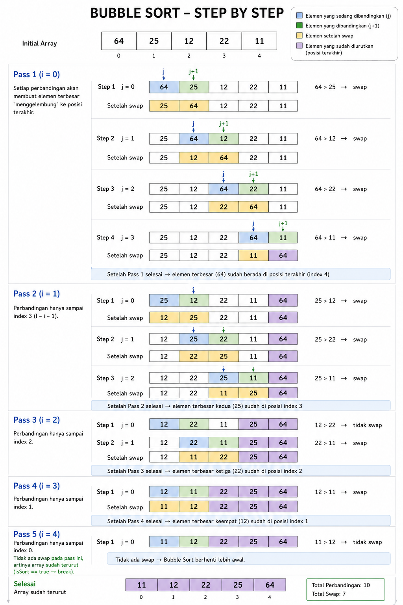

# Bubble Sort

```
func bubbleSort(arr []int) []int {
	l := len(arr)
	for i := 0; i < l-1; i++ {

		isSort := true

		for j := 0; j < l-i-1; j++ {
			if arr[j] > arr[j+1] {

                // swap
				temp := arr[j+1]
				arr[j+1] = arr[j]
				arr[j] = temp
				isSort = false

			}
		}

		if isSort == true {
			break
		}
	}

	return arr
}
```

