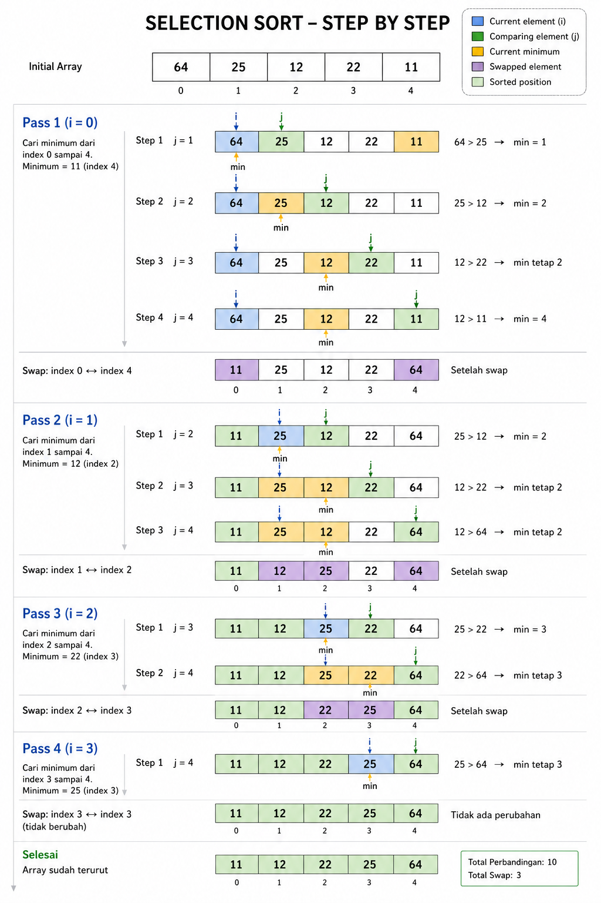

# Selection Sort

```
func selectionSort(arr []int) []int {
	l := len(arr)

	for i := 0; i < l-1; i++ {
		min := i
		for j := i + 1; j < l; j++ {
			if arr[min] > arr[j] {
				min = j
			}
		}
		// swap
		temp := arr[i]
		arr[i] = arr[min]
		arr[min] = temp
	}

	return arr
}
```

